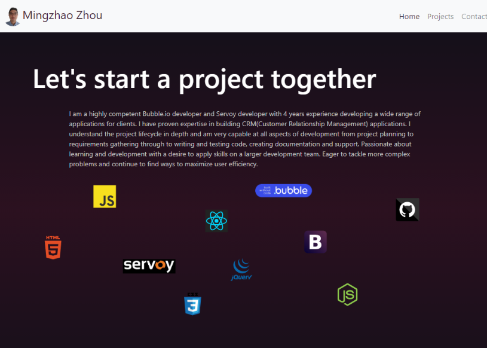
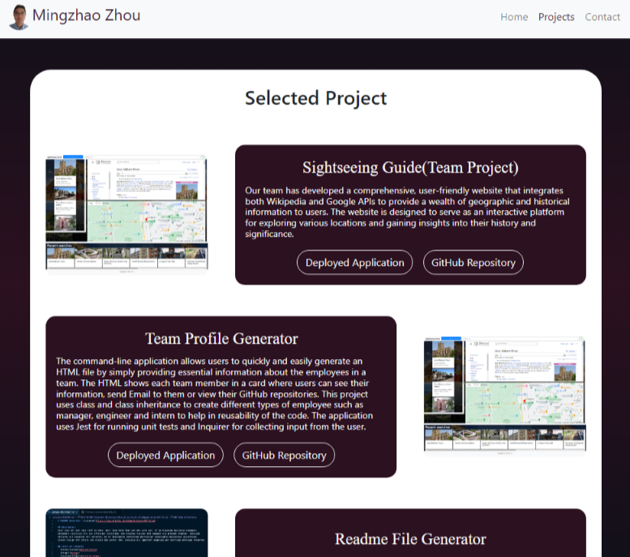
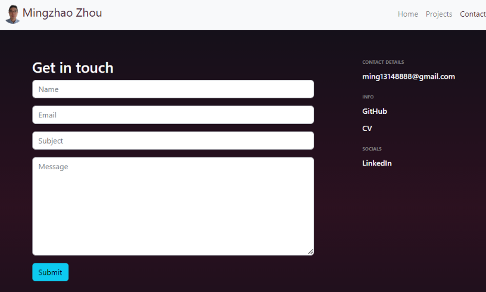

# React Portfolio

## Description

The porfolio is a fully responsive website that is built using React with React Router navigation, and Boostrap framework. This portfolio website is to show to recuiters, companies and people who interest in my projects and would like to work with me in the near future. It summaries my front end development journey. The website consists of Home, Projects and Contact pages where visitor can know about me, see my most recent deployed appliations, skills that I've learnt and contact me via links provided in the contact page.
 

## Table of Contents

- **[Pages](#pages)**
  - [Home](#home-page)
  - [Projects](#projects-page)
  - [Contact](#contact-page)
- [Deployment](#deployment)
- [Authors](#authors)
- [License](#license)
   

## Pages

### Home Page

The home page gives a short description about me and displays technologies that I am familiar with using icons and images

 

### Projects Page

The page shows the most recent projects that I've worked on. Users can see the running application in github page and the project repositories by clicking into the 'Deployed Application' and 'Github Repository' buttons.

 

### Contact Page

The left panel of the page is a contact form that users can send messages to me to get in touch. The right panel of the page shows my contact details as well as links for my GitHub page, CV and LinkedIn profile.

 

## Deployment

View my portfolio <a href="https://mingzhao91.github.io/react-portfolio/" target="_blank">here</a>.
 

## Authors

- **Mingzhao Zhou** - <a href="https://github.com/Mingzhao91" target="_blank">Mingzhao91</a>
   

## License

This project is licensed under the MIT License.
